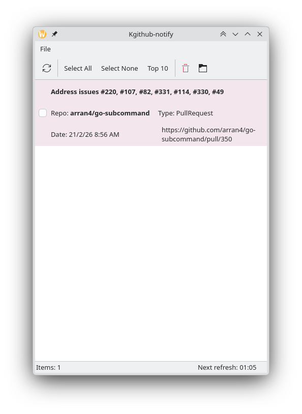
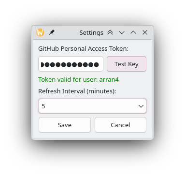

# Kgithub-notify

A GitHub notification system tray application written in C++ using Qt5. It notifies you when there are new GitHub notifications, allowing you to view them in your browser or dismiss them directly from the application.


## Features

*   **System Tray Integration**: Runs in the background and sits in your system tray.
*   **Periodic Polling**: Checks for new notifications every 5 minutes.
*   **Desktop Notifications**: Shows system notifications when new items arrive.
*   **KDE-First Integration**: Uses KWallet for token storage, KNotification for desktop alerts, KDE-themed icons, and quick links to KDE notification settings.
*   **Quick Actions**:
    *   **Open**: Opens the notification URL in your default browser. This also marks the notification as read.
    *   **Copy Link**: Copies the link to the notification (without referrer ID) to your clipboard.
    *   **Right-Click**: Access "Open", "Copy Link", or "Dismiss" (marks as read).
*   **Secure**: Stores your Personal Access Token (PAT) securely using Kwallet.




## Prerequisites

*   **C++ Compiler**: Must support C++17 (e.g., GCC 7+, Clang 5+, MSVC 2017+).
*   **CMake**: Version 3.10 or higher.
*   **Qt5**: Requires `Qt5Widgets` and `Qt5Network`.

### Installing Dependencies (Ubuntu/Debian)

```bash
sudo apt update
sudo apt install build-essential cmake qtbase5-dev qttools5-dev-tools libqt5svg5-dev
```

## Build Instructions

1.  **Clone the repository**:
    ```bash
    git clone https://github.com/yourusername/Kgithub-notify.git
    cd Kgithub-notify
    ```

2.  **Create a build directory**:
    ```bash
    mkdir build
    cd build
    ```

3.  **Configure and build**:
    ```bash
    cmake ..
    cmake --build .
    ```

4.  **Run the application**:
    ```bash
    ./Kgithub-notify
    ```

## Configuration

On the first run, or by selecting "Settings" from the File menu or tray icon context menu, you need to provide a GitHub Personal Access Token (PAT).

1.  Go to [GitHub Settings > Developer settings > Personal access tokens](https://github.com/settings/tokens).
2.  Generate a new token. You can use either a **Classic Token** or a **Fine-grained Token**.

### Token Scopes

To ensure the application can fetch your notifications and their details (especially for private repositories), your token must have the correct permissions.

**For a Classic Token:**
*   Select the `notifications` scope to access your inbox.
*   To receive notifications and fetch details (like pull request status or issue authors) for **private repositories**, you **must** also select the full `repo` scope.

**For a Fine-grained Token:**
*   **Repository Access:** Select the specific repositories you want to monitor, or "All repositories".
*   **Permissions:** Under "Repository permissions", grant **Read-only** access to:
    *   `Pull requests` (Required to fetch pull request details)
    *   `Issues` (Required to fetch issue details)
    *   `Metadata` (Usually required automatically)
*   **User Permissions:** Under "User permissions", grant **Read-only** access to:
    *   `Notifications` (Required to access your inbox)

3.  Copy the token and paste it into the application's settings dialog.

## License

This project is licensed under the BSD 3-Clause License - see the [LICENSE](LICENSE) file for details.
